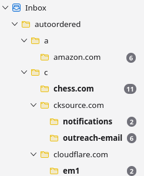

# Thunderbird AutoOrdered

**AutoOrdered** is a Thunderbird MailExtension that automatically organizes your disorganized Inbox into a clean, navigable folder hierarchy based on sender domains.

It is designed to tame high-volume email accounts (e.g., old accounts cluttered with newsletters, notifications, and spam) by grouping messages from the same sender into their own folders.

- Your Inbox will be close to empty (only emails that appeared once per origin-domain left)
- You won't lose any emails.
- Everything will be ordered
- For unsubscribing from many 
  mail-subscriptions, you only need to unsubscribe once per folder and can CTRL+A
  delete them all

## How it Helps Clean Up Clutter
If you have thousands of unorganized emails:
1.  **Run AutoOrdered**: It moves messages into `Inbox/autoordered/<Letter>/<Domain>/<Subdomain>`.
2.  **Review Groups**: navigate to a folder (e.g., `Inbox/autoordered/a/amazon.com`).
3.  **Take Action**:
    *   **Unsubscribe**: Open one recent email in that folder and use the "Unsubscribe" link.
    *   **Bulk Delete**: Since all emails from that sender are now in one isolated folder, you can right-click the folder and select **Delete** to remove thousands 
        of emails at once, without affecting other important mail.

Example:

## Features
*   **Hierarchical Sorting**: `amazon.com` goes to `a/amazon.com`, `billing.amazon.com` goes to `a/amazon.com/billing`.
*   **Idempotent**: Safe to run multiple times. It only moves messages if more than 1 message from a sender exists.
*   **Batch Processing**: Moves messages in chunks to avoid freezing Thunderbird or hitting IMAP limits.
*   **Safe**: Only touches the Inbox. Does not delete messages automatically.

## Installation

Option A (development, temporary):

1.  Download the latest release (or code).
2.  Open Thunderbird.
3.  Go to **Add-ons and Themes**.
4.  Click the **Gear icon** > **Debug Add-ons**.
5.  Click **Load Temporary Add-on...** and select the `manifest.json` file from this project.
    *   *Note: For permanent installation, zip the files and install as a standard extension.*

Option B (regular user, permanent):

1.  Zip all the files in this folder (ensure `manifest.json` is at the root of the zip).
2.  Rename the `.zip` file to `.xpi` (e.g., `tb-autoordered.xpi`).
3.  Open Thunderbird and go to **Add-ons and Themes**.
4.  Click the **Gear icon** -> **Install Add-on From File...**.
5.  Select your `.xpi` file.

## Usage
1.  Go to 'Addons and Themes', press the gearwheel in the top/center use Debug Addons
2.  After installation there should pop up
    the "Sort Inbox"-Button with a green AO-Symbol in the top right corner of 
    thunderbird as seen below.

     
    
    If it doesn't, just customize your toolbar:
    *   Right-click the main toolbar > **Customize...**
    *   Drag the **Sort Inbox** button (Green "AO" Icon) to your toolbar.
    *   Click **Save**.
3.  Click the **Sort Inbox** button.
4.  Open the **Error Console** (Ctrl+Shift+J) to see progress logs (`AutoOrdered: Moving...`).
5.  Check your Inbox for a new `autoordered` folder.

## Permissions
*   `accountsRead`: To find your Inbox.
*   `messagesRead` & `messagesMove`: To organize your emails.
*   `accountsFolders`: Required to create the necessary subfolders.

## Thunderbird Version
Tested with Thunderbird v147.0

## Issues
Top Level Domain suffixes like '.co.uk' are recognized as domains, if that disturbs you - feel free to participate and fix it with a pullrequest. 

## License
MIT License
